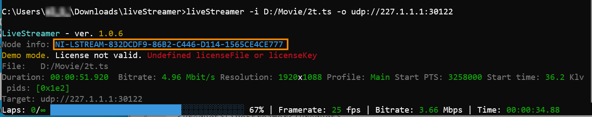

  

# LiveStreamer

Live STANAG 4609 re-streamer utility.

More [info](https://www.impleotv.com/content/livestreamer/help/index.html).

## System Requirements

OS: Windows 10 64 bit / Linux x64.

## Installation

**LiveStreamer** can be downloaded as a **zip** file.  

## Download link

|          | Version             | Download link                                                           | 
|:---------|:-------------------:|:------------------------------------------------------------------------|
| **LiveStreamer Windows x64** |  v1.0.6 | [liveStreamer.zip](https://github.com/impleotv/live-streamer-release/releases/latest/download/liveStreamer.zip) | 
| **LiveStreamer Linux x64**   |  v1.0.6 | [liveStreamerLinux.zip](https://github.com/impleotv/live-streamer-release/releases/latest/download/liveStreamerLinux.zip) | 

*Released on Wed, 9 Feb, 13:21 GMT+2*

## License

No license is needed for application evaluation - it will work in demo mode (with some restrictions). 

**LiveStreamer** is a node locked software, so you have to get a license (after purchasing the SW) in order to lift demo restrictions. Please install the application and fill an [online form](https://docs.google.com/forms/d/e/1FAIpQLSd_XW6bDsFce1G1cpds4gMQNlwNax0CvkWzcMbscxZ5rLaIbA/viewform), providing the ***Node Info*** string (IMPORTANT!!!) for the target machine.  

Node Info string can be seen when you run the application:  

Applying license. Use one of two options:

- passing license info as the arguments (with --licenseFile and --licenseKey)
- copying license file (.lic) and a key (.txt) file into current working directory

